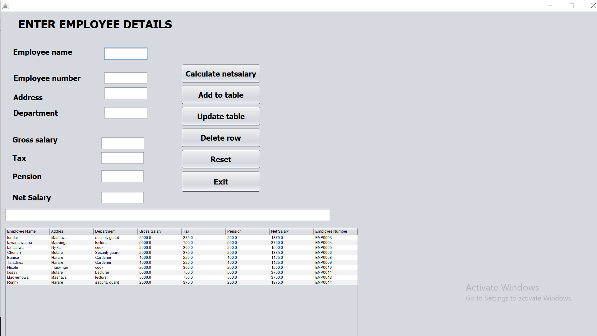
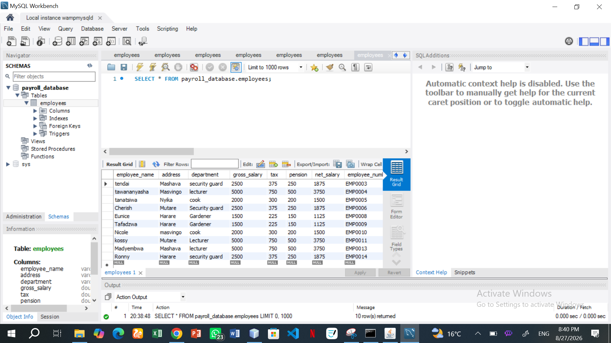

# Payroll Management System

A desktop-based Java Swing application integrated with a MySQL database to efficiently handle employee records, net salary calculations, and data persistence.

## Features

* **Net Salary Calculation:** Automatically computes gross salary. Deducts tax, pension and calculate final net salary.
* **Employee Record Management:** Add new employees, update existing details, and delete rows directly from the application table.
* **Database Integration:** Full CRUD synchronization with a MySQL database.
* **Interactive Table View:** Displays real-time employee data inside a JTable.
* **Form Controls:** Quick reset functionality to clear form fields and exit controls.

### Application GUI

### MySQL Workbench Database Schema

## Tech Stack

* **Programming Language:** Java
* **Database Management:** MySQL
* **IDE:** NetBeans
